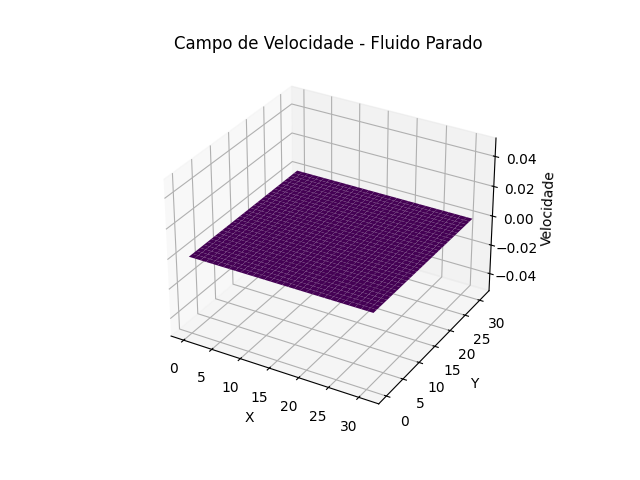
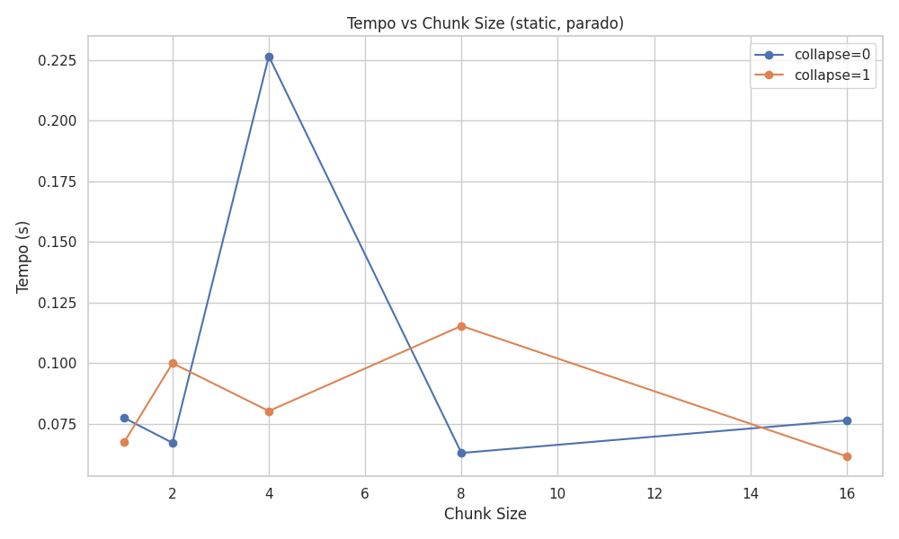
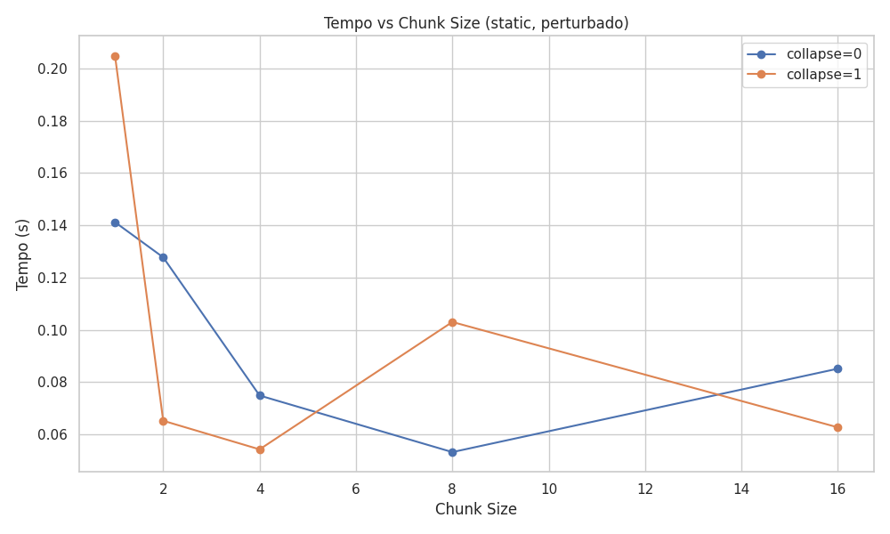
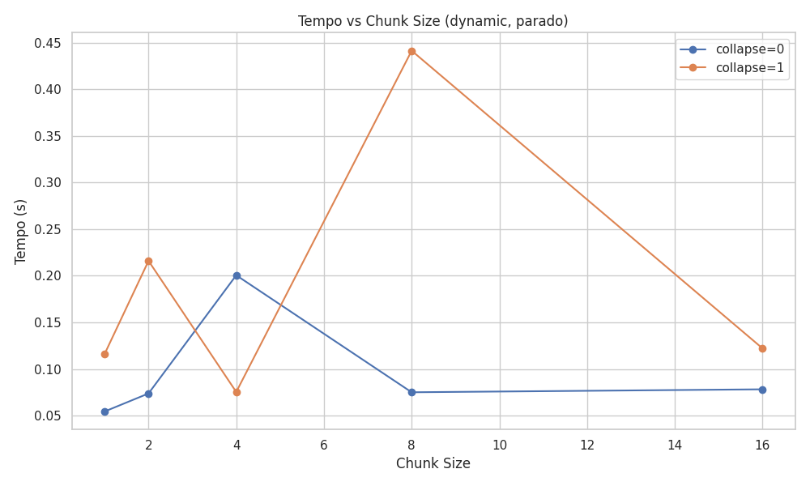
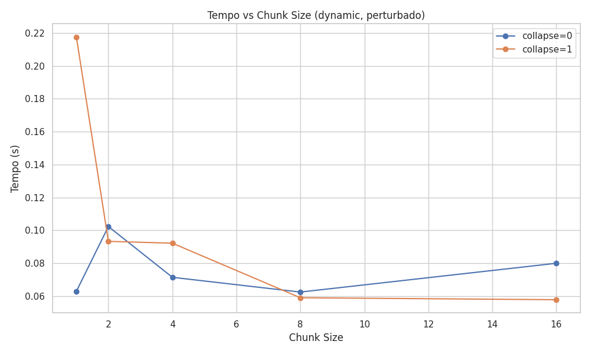
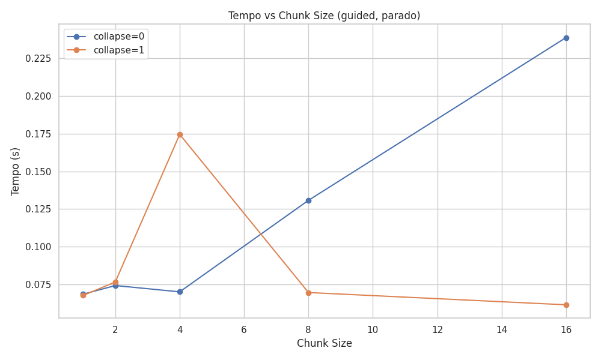
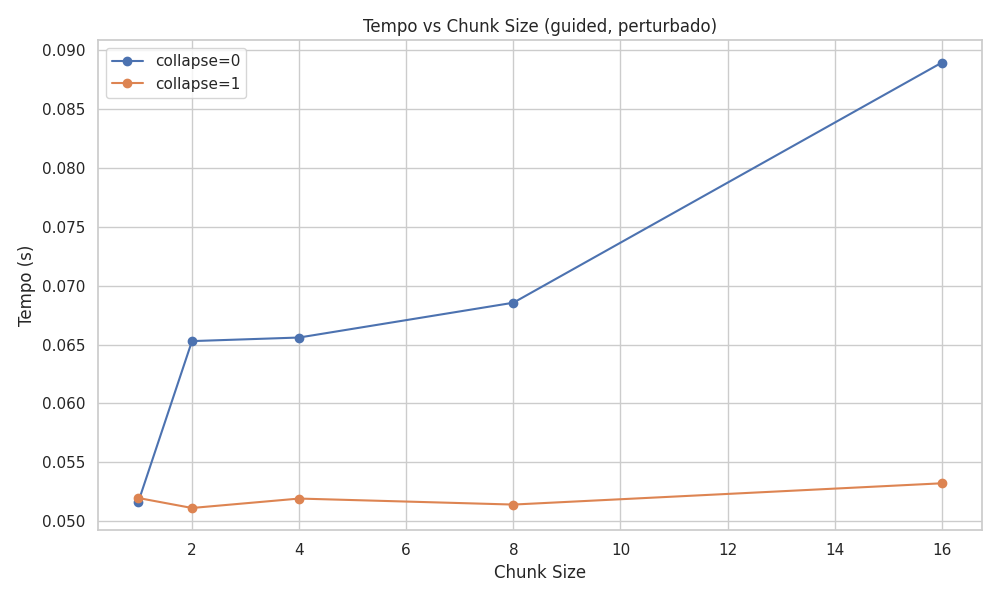
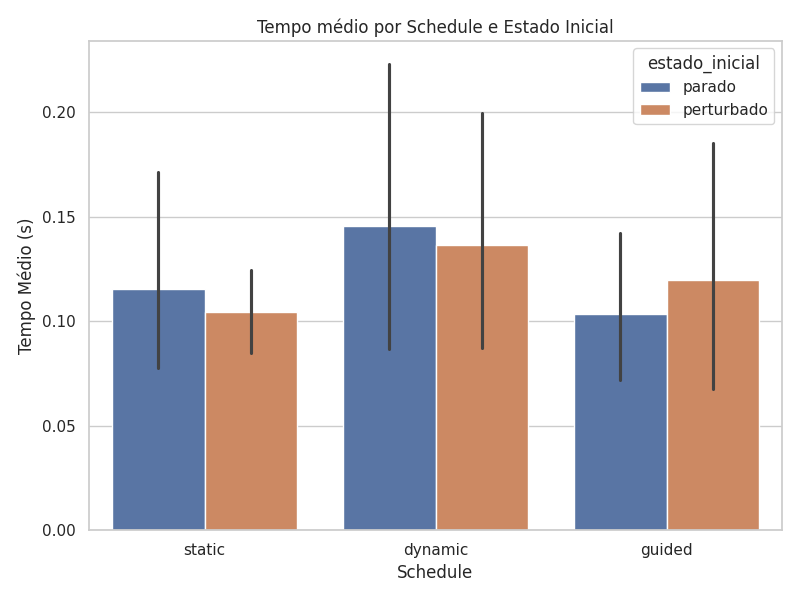

# Tarefa 11: 

Este código simula a difusão de calor em 3D, resolvendo uma equação que calcula como a temperatura se espalha ao longo do tempo em um cubo de 𝑁×𝑁×𝑁 pontos (N=32).

Iniciado a matriz sem pertubação e logo depois realizando uma pertubação no centro. Abaixo, os gráficos representam os campos de velocidades iniciais do fluido antes e após qualquer perturbação. Cada ponto da superfície mostra a velocidade do fluido em uma posição (x, y) da malha, sendo o eixo Z a indicação da intensidade da velocidade em cada ponto da grade.

|Fluido parado|Fluido com pertubação|
|------------------|------------------|
|||

## Teoria
| Cláusula     | Impacto                                                                                                                                                     |
| ------------ | ----------------------------------------------------------------------------------------------------------------------------------------------------------- |
| `schedule`   | Define a política de distribuição das iterações. Pode melhorar o load balancing ou reduzir overhead.                                                        |
| `collapse`   | Junta múltiplos loops para permitir paralelismo mais fino e melhor uso dos threads.                                                                         |
| `chunk_size` | Define o "tamanho dos blocos" por thread. Chunk pequeno = mais balanceado, mas mais overhead. Chunk grande = menos overhead, mas pode causar desequilíbrio. |

Os **tipos de schedules** são:
- **Static**: divide as iterações do loop em partes iguais entre as threads, de forma fixa e antecipada, antes do loop começar.
- **Dinamic**: as iterações são divididas em blocos menores (chunks), e as threads pegam um novo bloco assim que terminam o anterior.
- **Guided**: os primeiros blocos são maiores e vão diminuindo de tamanho conforme a execução avança.

## Resultados
Apresentando desempenho estável e bom com collapse=0, enquanto que com collase=1 o temo oscilou bastante, parecendo ineficiente aqui, provavelmente porque a sobrecarga de colapsar dois loops paralelos não compensa com essa configuração.
|Static - Fluido parado|Static - Fluido pertubado|
|------------------|------------------|
|||

O dynamic tem bom desempenho para chunks pequenos e sem collapse. O collapse=1 parece piorar o desempenho, possivelmente por conflito com a alocação dinâmica e maior sobrecarga de balanceamento.
|Dynamic - Fluido parado|Dynamic - Fluido pertubado|
|------------------|------------------|
|||

O guided é eficiente quando bem configurado, mas muito sensível a chunk size, especialmente com collapse=1. Ideal para casos com carga variável, como simulações perturbadas.
|Guided - Fluido parado|Guided - Fluido pertubado|
|------------------|------------------|
|||

O gráfico reresenta os schedules usados e seu tempo médio de execução. As linhas pretas são linhas de erro (error bars), indicando a incerteza ou variação dos dados. As linhas pequenas representam medições consistentes, enquanto linhas grandes medições instáveis ou com muita flutuação.
|Tempo Médio por Schedule e Estado do fluido|
|------------------|
||

Em uma análise geral, o schedule: guided apresentou melhores desempenho de tempo.